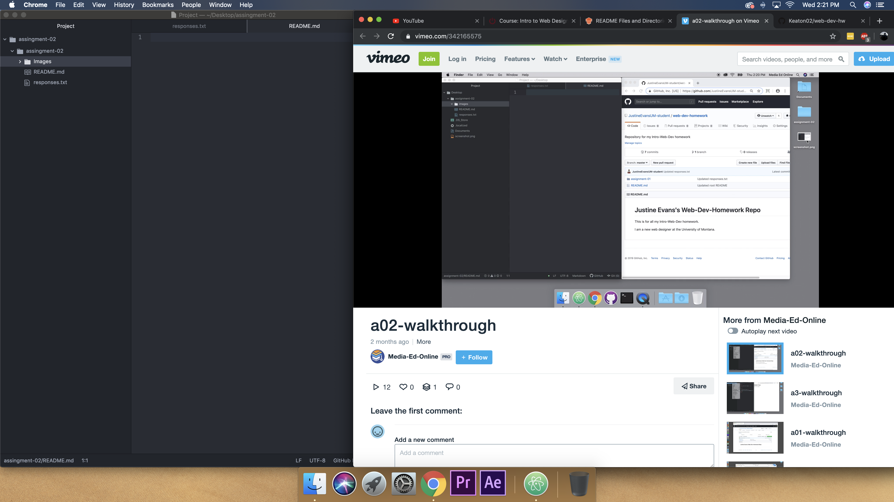

# Assignment-02
## Keaton Habeck

I decided to take this class because I wanted to know about the back end of websites. I've found code to be fascinating and wanted to learn more about how it works and the ways we can use it for our own projects.

Three things I've learned/hope to learn:

1. How to program certain actions within a websites
2. How to make a website visible on the website
3. What certain code messages mechanism

[Apple Store](https://www.apple.com/)

[My Responses File](./responses.txt)

